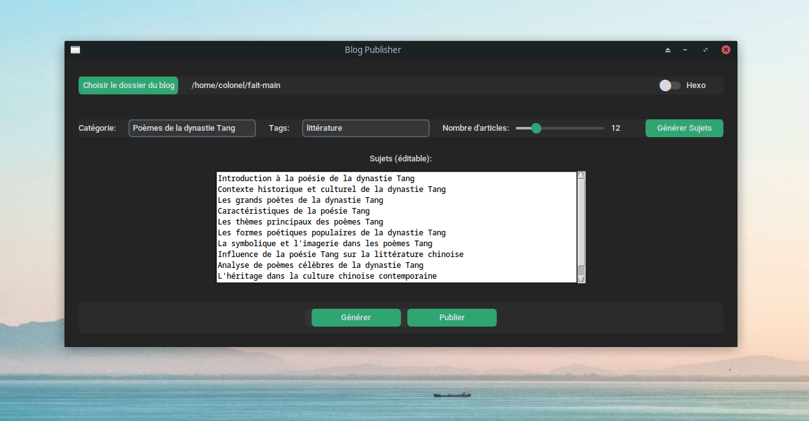

# Article Generator

## Overview

This project consists of two Python scripts: `BlogPublisher`, a graphical user interface application for generating and publishing blog articles, and an auxiliary script that provides functionalities such as content generation, article updating, and publishing automation utilizing the OpenAI API.




## Prerequisites

Ensure you have the following prerequisites installed on your system:

- Python 3.x
- CustomTkinter
- Requests
- PyYAML

Additionally, you must have an OpenAI API key to use the content generation features.

## Installation

1. Install the required Python libraries by running the following command:

    ```bash
    pip install customtkinter requests pyyaml
    ```

2. Place your OpenAI API key in the auxiliary script, replacing the `API_KEY` variable's value.

## Usage

### Main Script

The script provides a user-friendly interface for configuring and managing your blog's content. Features include setting up blog directory and type, configuring article parameters, and directly publishing articles.

Execute the script by running:

```bash
python main.py
```

## Contributing

Contributions are welcome. You can contribute by reporting bugs, suggesting enhancements, or submitting pull requests.

## License

This project is licensed under the MIT License - see the LICENSE file for details.

## Acknowledgments

- Thanks to CustomTkinter for the GUI framework.
- Thanks to OpenAI for the API used in content generation.

